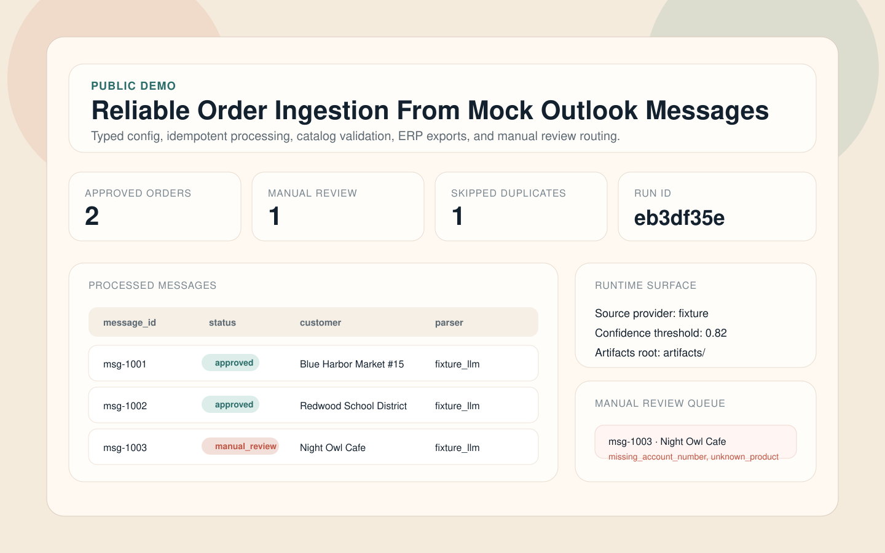
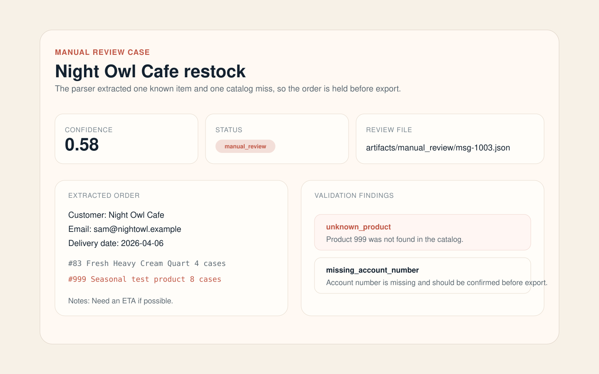
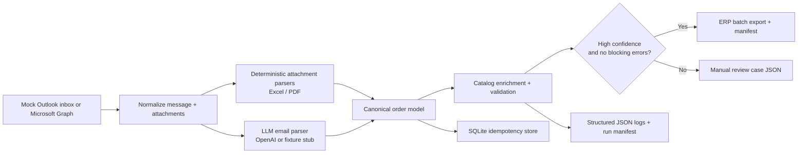

# LLM Order Extractor

A production-style ingestion pipeline that reads Outlook orders, uses LLM-assisted parsing to extract structured line items, validates them against a product catalog, and exports ERP-ready batch files.

The project is intentionally public and sanitized:

- The default runtime uses mock Outlook fixtures instead of a real mailbox.
- A fixture-backed LLM response layer makes the demo fully runnable without secrets.
- Microsoft Graph and OpenAI can be enabled by swapping the source provider in `config.json`.

## Demo Screens



*Operations view with polished status language, parser-path summaries, and a recruiter-friendly batch overview.*



*Review workspace showing action-oriented issue framing instead of raw internal validation codes.*

## Architecture



## Quickstart

### 1. Install dependencies

```bash
python3 -m pip install -r requirements.txt
```

### 2. Run the fixture-backed pipeline

```bash
python3 main.py --source fixture
```

This processes the sanitized mock inbox in [`tests/fixtures/mock_outlook_inbox.json`](tests/fixtures/mock_outlook_inbox.json), writes artifacts to `artifacts/`, exports approved orders to ERP text format, and routes low-confidence orders into `artifacts/manual_review/`.

### 3. Launch the Streamlit demo dashboard

```bash
streamlit run ui_streamlit.py
```

### 4. Run the test suite

```bash
python3 -m unittest discover -s tests -v
```

## Docker

Run the dashboard:

```bash
docker compose up demo-ui
```

Run the batch pipeline:

```bash
docker compose run --rm demo-cli
```

## Live Graph/OpenAI Mode

Copy `config.example.json` to `config.json` and update:

- `source.provider` to `"graph"`
- `source.client_id`, `source.client_secret`, `source.tenant_id`, `source.user_email`
- `openai.api_key`

Then run:

```bash
python3 main.py --source graph --limit 25
```

## Output Artifacts

Each run generates a small artifact set under `artifacts/`:

- `exports/*.txt`: ERP-ready H/D/E batch file
- `exports/*.manifest.json`: export summary
- `manual_review/*.json`: cases that need human validation
- `logs/pipeline.jsonl`: structured pipeline logs
- `runs/run_<id>.json`: full run manifest
- `state/pipeline_state.sqlite3`: idempotency store

## Example ERP Output

```text
H	8306			8306										4/6/2026
D	3	CASE	24.0
D	31	CASE	18.0
D	72	CASE	6.0
E
```